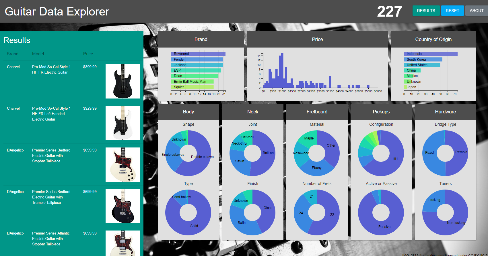

Guitar Data Explorer
====================
Welcome! This tool's purpose is to explore various guitar models to help you to find your dream instrument.  
It can also be used for general research purposes to answer questions such as:
1. What is a given brand's niche with regard to feature-set?
2. What features are most associated with higher-end models?
3. When comparing comparable instruments, how much of a premium is placed on American-made?

Project Components
------------------
The project is broken into 2 broad components:
1. Data ETL Pipeline: (a) Data Scraper; (b) Data Cleaner; (c) Data Pusher
2. Data Visualization

Description of Files
--------------------

Data ETL Pipeline

File                              |  Description
----------------------------------|------------------------------------------------------------------------------------
Brand                             |  Manufacturer of the instrument.
Price                             |  Price of the instrument in US Dollars.
Country of Origin                 |  Where the instrument was manufactured.

Data Vizualization

File                              |  Description
----------------------------------|------------------------------------------------------------------------------------
Brand                             |  Manufacturer of the instrument.
Price                             |  Price of the instrument in US Dollars.
Country of Origin                 |  Where the instrument was manufactured.

Description of Data
-------------------
Category                          |  Description
----------------------------------|------------------------------------------------------------------------------------
Brand                             |  Manufacturer of the instrument.
Price                             |  Price of the instrument in US Dollars.
Country of Origin                 |  Where the instrument was manufactured.
Body - Shape                      |  The shape of the guitar body, with "Single Cutaway" meaning a cutout on the underside of the fretboard in the Fender Telecaster style.  "Double Cutaway" means a cutout both above and below the fretboard like a Fender Stratocaster.  "V" indicates a v-shaped body like the Gibson flying V, and "Z" indicates a z-type body like that of a Gibson Explorer.
Body - Type                       |  Whether the body is made of solid wood or whether it is semi-hollow, or hollow.
Neck - Joint                      |  The means of attaching the neck to the body.
Neck - Finish                     |  What type of finish is used on the neck, with "Gloss" referring to a thicker, higher sheen, typically through use of polyeurathane or similar.  "Satin" means a thinner, lower sheen finish.  "Oiled" means a simple finish
Fretboard - Material              |  The type of wood or other material used for the fretboard.
Fretboard - Number of Frets       |  How many frets are set in the fretboard.
Pickups - Configuration           |  The types of pickups used and in what positions. Placement is bridge -> neck; H = humbucker, S = single coil. Example: HSS means bridge humbucker, middle single coil, and neck single coil.
Pickups - Active or Passive       |  Whether the signals received from the pickups are boosted by an internal preamp. 

