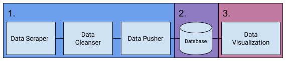

# Guitar Data Explorer

## Introduction
Welcome!  I built this app as a better way to find my dream instrument as a result of being frustrated with the limited searching capabilities on guitar retailer websites.  It can also be used for general research purposes to answer questions such as:
1. What is a given brand's niche with regard to feature-set?
2. What features are most associated with higher-end models?
3. When comparing comparable instruments, how much of a premium is placed on American-made?


[TRY IT](https://astronge.github.io) *Best viewed using a screen of resolution 1920x1080 or above.*

## Instructions
### Interacting
The dashboard contains a number of charts that display guitar-related information, such as body shape or fretboard material.  Interact with the charts by clicking on them to filter for the features that you are interested in.  Selecting a feature from a particular chart will filter out all models that do not have that particular feature.  

### Filtering
Within a chart, selections are OR and between charts selections are AND.  For example, selecting "Double Cutaway" from Body Shape and both "Maple" and "Rosewood" from fretboard material, the resulting filter would be equivalent to the following SQL query:
```
SELECT guitars 
  FROM guitar
 WHERE (body_shape = "Double Cutaway") 
   AND (fretboard_material = "Maple" OR fretboard_material = "Rosewood")
```
The number in the header bar refers to how many guitars meet your filtering criteria.

### Viewing Results
Once you are satisfied with your selections, clicking the RESULTS button will open the results panel for you to be able to scroll through the list of guitars that were returned. 

### Call to Action
Once you have identified the right instrument, clicking on its image will take you to the Musicians Friend website where you can complete your purchase.  Go ahead, you deserve it!

## Project Design
### Components and Flow

This project is broken into 3 components:
1. Data ETL Pipeline: (a) Data Scraper; (b) Data Cleanser; (c) Data Pusher
2. Database
3. Data Visualization


### ETL Pipeline
All ETL Pipeline components are written in Python.

The data scraper makes use of the BeautifulSoup and Selenium libraries and follows [ethical scraping principles](https://towardsdatascience.com/ethics-in-web-scraping-b96b18136f01).  

The data cleanser utilizes the Pandas and NumPy libraries.  Jupyter Notebook was used for data exploration and developing the data cleansing steps.

The data pusher uses the Firebase Admin library to delete the previous dataset and write the clean data to the database.

### Database
Google Cloud Firestore, a NoSQL database, is used as the backend for this project.

### Data Visualization
The data visualization is a web-based application (HTML/CSS/Javascript) that both fetches the data from the database and then renders it once the data have been fully retrieved.  Libraries: d3.js, dc.js, crossfilter.js, Bootstrap 4, Bootstrap Material Design.

Description of Data 
-------------------
Dimension                         |  Description
----------------------------------|------------------------------------------------------------------------------------
Brand                             |  Manufacturer of the instrument.
Price                             |  Price of the instrument in US Dollars.
Country of Origin                 |  Where the instrument was manufactured.
Body - Shape                      |  The shape of the guitar body, with "Single Cutaway" meaning a cutout on the underside of the fretboard in the Fender Telecaster style.  "Double Cutaway" means a cutout both above and below the fretboard like a Fender Stratocaster.  "V" indicates a v-shaped body like the Gibson flying V, and "Z" indicates a z-type body like that of a Gibson Explorer.
Body - Type                       |  Whether the body is made of solid wood or whether it is semi-hollow, or hollow.
Neck - Joint                      |  The means of attaching the neck to the body.
Neck - Finish                     |  What type of finish is used on the neck, with "Gloss" referring to a thicker, higher sheen, typically through use of polyeurathane or similar.  "Satin" means a thinner, lower sheen finish.  "Oiled" means a simple finish
Fretboard - Material              |  The type of wood or other material used for the fretboard.
Fretboard - Number of Frets       |  How many frets are set in the fretboard.
Pickups - Configuration           |  The types of pickups used and in what positions. Placement is bridge -> neck; H = humbucker, S = single coil. Example: HSS means bridge humbucker, middle single coil, and neck single coil.
Pickups - Active or Passive       |  Whether the signals received from the pickups are boosted by an internal preamp. 

## Getting This to Work Locally
### Set Up Firebase
1.  Create a new [Firebase](https://firebase.google.com/) collection called "guitars".
2.  Update the guitars-firebase.json file located in the guitar_scraper folder.  Adding your [service account](https://developers.google.com/identity/protocols/OAuth2ServiceAccount) credentials will allow the data pusher to access the Firestore database.
3.  Replace the Firebase Initialization script in index.html to include your [personal configs](https://firebase.google.com/docs/web/setup?authuser=0).  This will allow data to be pulled from Firebase by the web app.

### Install Dependencies
Install guitar_scraper dependencies by opening a terminal window from the guitar_scraper folder and running ```pipenv install```, which will grab everything in Pipfile.lock.  If you don't have pipenv installed, follow the instructions [here](https://pipenv.readthedocs.io/en/latest/).  

### Get Fresh Data
To initiate the scrape/clean/push process, execute run_pipeline.py.  Note that while the clean and push processes run fairly quickly, the scrape portion takes quite some time (mostly due to sleeping a bit between each request).  

## License
MIT
